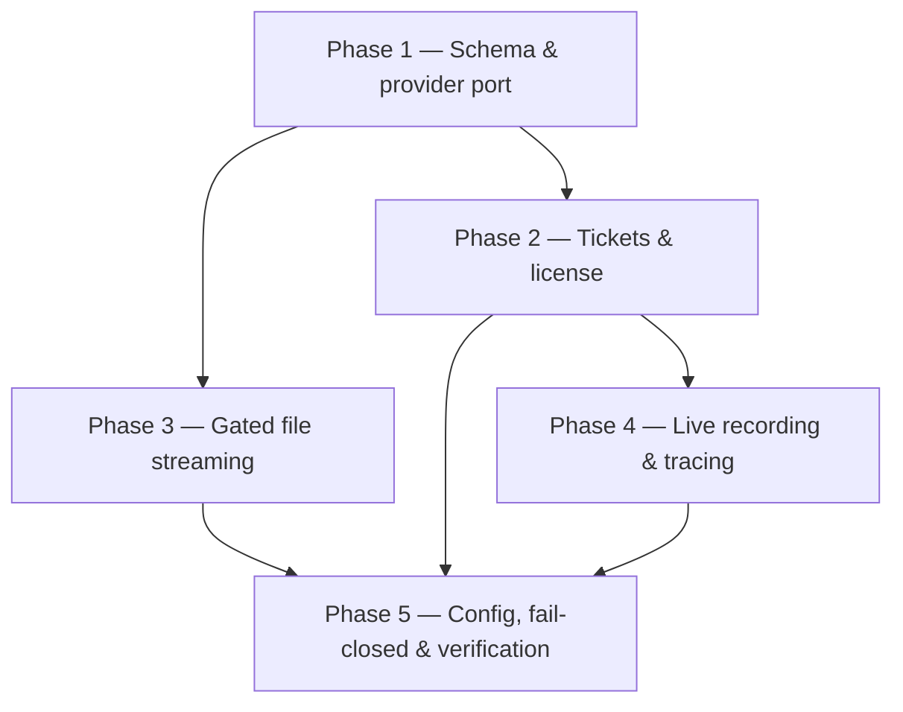

# Implementation Plan

> Server-side anti-piracy support in `apps/api` + the `apps/web` media BFF. Provider-backed and provider-agnostic. Verify with `pnpm --filter @bilgim/api typecheck` + `test`. Some tasks fully verify only once a DRM_Provider is selected/configured (Open Question 1) — build against the `ProtectionProvider` port with a dev fallback until then.

## Overview

Five phases: schema + provider port (Phase 1); playback tickets + license proxy (Phase 2); hardened gated file streaming (Phase 3); live recording finalization + leak-trace logging (Phase 4); configuration, fail-closed, and verification (Phase 5). Each task references requirements in this spec and pairs with `frontend-redesign` Phase 1.

## Tasks

## Phase 1 — Schema & provider port

- [x] 1.1 Add `Group.downloadAllowed` (default false), `PlaybackSession` model, and MediaAsset protection metadata; generate Prisma migration.
  - _Requirements: 4.5, 6.1, 6.2_
- [x] 1.2 Define the `ProtectionProvider` port + a clearly-flagged dev-fallback adapter (wraps current proxy); wire DI in a new `modules/protection` (or media extension).
  - _Requirements: 2.1, 7.2_
- [x] 1.3 Add secure configuration for DRM credentials, ticket TTL, retention, watermark format (server secrets only).
  - _Requirements: 7.1, 7.4_

## Phase 2 — Playback tickets & license brokering

- [x] 2.1 `PlaybackTicketService` + `GET /media/assets/:id/playback-ticket`: verify APPROVED entitlement, sign short-lived manifest reference, attach watermark identity + `downloadAllowed` + expiry; never return permanent URLs.
  - _Requirements: 1.1, 1.2, 1.3, 1.4, 3.1, 3.3_
- [x] 2.2 `WatermarkIdentityService`: derive per-viewer tag from auth session; persist `PlaybackSession` mapping.
  - _Requirements: 3.1, 3.2, 3.4, 6.1_
- [x] 2.3 `LicenseProxyController` `POST /media/assets/:id/license/:keySystem`: validate ticket+entitlement, broker EME challenge to provider for Widevine/FairPlay/PlayReady; keys stay server-side.
  - _Requirements: 2.1, 2.2, 2.3, 2.4, 2.5_
- [x] 2.4 Property tests: no-URL-without-entitlement (Property 1) + keys-server-side (Property 2).
  - _Requirements: 1.2, 2.2, 2.4_

## Phase 3 — Hardened gated file streaming

- [x] 3.1 `ProtectedFileController` `GET /media/assets/:id/stream`: entitlement-checked byte streaming; inline vs attachment by `downloadAllowed`; never expose storage URL.
  - _Requirements: 4.1, 4.2, 4.3, 4.4_
- [x] 3.2 Expose `downloadAllowed` on Group/lesson DTOs (server-authoritative) and a group-settings update endpoint for the toggle.
  - _Requirements: 4.5_
- [x] 3.3 Property test: download gating server-enforced (Property 3).
  - _Requirements: 4.1, 4.2, 4.4_

## Phase 4 — Live recording & leak tracing

- [x] 4.1 `RecordingFinalizer`: on LiveSession end, finalize recording → MediaAsset on lesson; ENDED/RECORDING_FAILED; recording playable only via protected path.
  - _Requirements: 5.1, 5.2, 5.3_
- [x] 4.2 Admin watermark/session lookup: map a watermark/session marker back to a learner identity; ingest provider concurrency/anomaly signals where available.
  - _Requirements: 6.3, 6.4_
- [ ] 4.3 Property test: recording terminal state + protected-only playback (Property 6).
  - _Requirements: 5.1, 5.2, 5.3_

## Phase 5 — Config, fail-closed & verification

- [x] 5.1 Fail-closed behavior: when DRM_Provider unavailable, refuse protected playback in production (no unprotected fallback); actionable error.
  - _Requirements: 7.3_
- [x] 5.2 Property test: fail-closed (Property 5) + watermark-bound-to-session (Property 4); security review that no vendor key/URL leaks to client responses.
  - _Requirements: 7.3, 3.1, 2.2_
- [x] 5.3 Full `typecheck` + `test` green; integration suite (ticket→license→playback with mock provider; negative entitlement/download tests).
  - _Requirements: 1.1, 2.1, 4.1_

## Task Dependency Graph



```json
{
  "waves": [
    { "wave": 1, "name": "Foundations", "tasks": ["1.1", "1.2", "1.3"] },
    { "wave": 2, "name": "Tickets, license & gated streaming", "tasks": ["2.1", "2.2", "2.3", "2.4", "3.1", "3.2", "3.3"] },
    { "wave": 3, "name": "Live recording & tracing", "tasks": ["4.1", "4.2", "4.3"] },
    { "wave": 4, "name": "Config, fail-closed & verification", "tasks": ["5.1", "5.2", "5.3"] }
  ]
}
```

## Notes

- **External dependency:** full verification requires a chosen DRM_Provider + keys (Open Question 1, shared with `frontend-redesign` OQ1). Until then, implement against the `ProtectionProvider` port with the flagged dev fallback.
- **Pairs with `frontend-redesign` Phase 1:** the BFF endpoints here back the client `useProtectedMedia`/`ProtectedFileViewer`; coordinate the contract (ticket shape, license path, stream endpoint).
- **Honest limits:** this backend provides encryption + access control + traceability, not absolute capture prevention; ship the honest messaging (frontend task 1.7) alongside.
- **Privacy:** PlaybackSession retention is configurable; balance leak-investigation needs against data minimization (Open Question 5).
