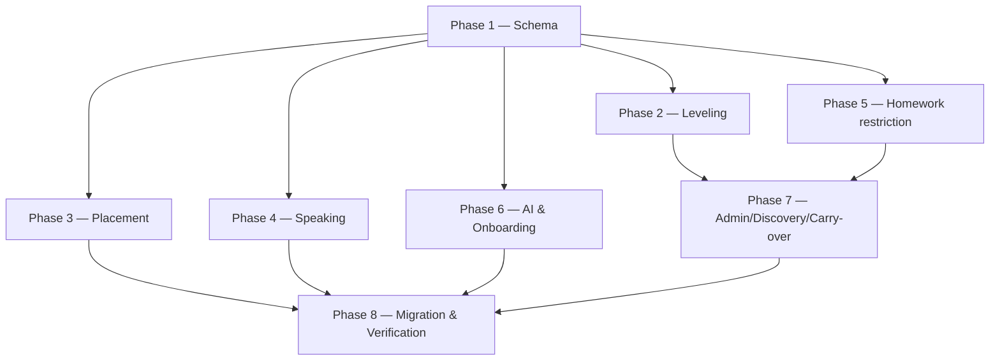

# Implementation Plan

> Backend-led refocus of the existing platform to English-only. Additive + deprecating (no destructive migration). Verify with `pnpm --filter @bilgim/api typecheck` + `test` after each phase; run Prisma migrations in a dev DB before merging. Each task references requirements in this spec.

## Overview

Eight phases: schema additions for leveling/placement/proficiency (Phase 1) underpin the leveling, placement, and speaking modules (Phases 2–4); homework restriction and AI/onboarding refocus (Phases 5–6) narrow the product; admin + carry-over re-theming (Phase 7); and the idempotent migration + verification (Phase 8) protect existing data. Specialty is deprecated, not deleted.

## Tasks

## Phase 1 — Schema & data model

- [x] 1.1 Add `cefrLevel` (A1–C2 enum) + `examTrack` to Course, and nullable `cefrLevel` override to Group; generate Prisma migration.
  - _Requirements: 3.1, 3.2, 3.3, 3.4_
- [x] 1.2 Add learner proficiency (`currentCefrLevel` nullable = UNASSESSED) + `ProficiencyLevelHistory` model.
  - _Requirements: 4.1, 4.2, 4.4_
- [x] 1.3 Add `PlacementAssessment` + `PlacementAnswer` models (resumable) and `ExamTrack` admin model.
  - _Requirements: 5.1, 5.4, 5.5, 17.1_
- [x] 1.4 Mark Specialty/OnboardingQuestion/OnboardingAnswer/SpecialtyModule as deprecated/read-only (no deletion); document decommission as separate step.
  - _Requirements: 2.4, 16.5_

## Phase 2 — Leveling module

- [x] 2.1 Create `modules/leveling` (module/controller/service/repository) with course/group level assignment + inheritance/override; reject course publish without level.
  - _Requirements: 3.1, 3.3, 3.4, 3.5_
- [x] 2.2 Implement learner proficiency get/set + history; expose level to discovery.
  - _Requirements: 4.1, 4.3, 4.4, 4.5, 3.6_
- [x] 2.3 Property test: level required + inheritance/override (Property 2).
  - _Requirements: 3.1, 3.3, 3.4, 3.5_

## Phase 3 — Placement module

- [x] 3.1 Create `modules/placement`: start assessment (READING/GRAMMAR/VOCABULARY items), resumable answers.
  - _Requirements: 5.1, 5.4_
- [x] 3.2 Submit + score → compute CEFR; set learner proficiency; record per-skill result; emit placement-result notification.
  - _Requirements: 5.2, 5.3, 5.5, 15.1_

## Phase 4 — Speaking/pronunciation assessment

- [x] 4.1 Create `modules/speaking`: accept audio submission as AUDIO MediaAsset (allowlist content types) for SPEAKING/PRONUNCIATION.
  - _Requirements: 7.1, 7.2, 7.7_
- [x] 4.2 Enqueue AI scoring on SUBMITTED; produce numeric score + pronunciation/fluency feedback as AI_DRAFT; instructor override before GRADED.
  - _Requirements: 7.3, 7.4, 7.6_
- [x] 4.3 Scoring failure handling: mark job failed after retries + notify instructor; homework-graded notification on grade.
  - _Requirements: 7.5, 15.3_
- [x] 4.4 Property test: audio integrity + always score-or-flag (Property 4).
  - _Requirements: 7.1, 7.5, 7.7_

## Phase 5 — Homework restriction to eight skills

- [x] 5.1 Restrict assignment creation to the 8 Language_Module_Type values; reject Legacy_Module_Type with `MODULE_TYPE_NOT_SUPPORTED`; validate group-enabled state server-side.
  - _Requirements: 6.1, 6.2, 6.3, 6.6_
- [x] 5.2 Seed 8 GroupModule records on group creation; replace per-Specialty catalog with a single global English catalog (admin).
  - _Requirements: 6.4, 6.5, 17.2_
- [x] 5.3 AI grading refocus: WRITING/GRAMMAR feedback dimensions (grammar/vocabulary/coherence), transition to IN_REVIEW, keep AI-likelihood flag.
  - _Requirements: 9.1, 9.2, 9.3, 9.4_
- [x] 5.4 Property test: homework restricted to 8 skills (Property 3).
  - _Requirements: 6.1, 6.3, 6.6_

## Phase 6 — AI gateway & onboarding refocus

- [x] 6.1 Refocus AI tutor intents (EXPLAIN/TRANSLATE/EXAMPLE), enforce no-verbatim-answer policy + hint rewrite; audit calls; remove SPECIALTY_CLASSIFY.
  - _Requirements: 8.1, 8.2, 8.3, 8.4, 8.5_
- [x] 6.2 Remove specialty step from instructor onboarding; collect English-teaching attributes (CEFR levels taught, Exam_Track); route to dashboard; keep 14-day trial creation.
  - _Requirements: 10.1, 10.2, 10.3, 10.4, 2.1_
- [x] 6.3 Add `specialtyId` deprecation shim (accept + ignore during window).
  - _Requirements: 2.3_

## Phase 7 — Admin, discovery & carry-over re-theming

- [x] 7.1 Admin: manage Exam_Track options + global 8-skill catalog enable/disable (preserve existing submissions on disable); audit-log changes.
  - _Requirements: 17.1, 17.2, 17.3, 17.4_
- [x] 7.2 Discovery: replace specialty facets with CEFR level + Exam_Track filters; only English published/discoverable results; keep Payme/enrollment flow.
  - _Requirements: 14.1, 14.2, 14.3, 14.4, 14.5_
- [x] 7.3 Re-theme gamification badges/challenges for English; allow deactivating/re-theming non-English badges; verify billing/live unchanged.
  - _Requirements: 13.1, 13.2, 13.3, 13.4, 11.1, 12.1_

## Phase 8 — Migration & verification

- [x] 8.1 Implement idempotent `Migration_Process`: default CEFR on level-less courses, UNASSESSED learners, preserve legacy assignments/submissions, retain specialty data read-only.
  - _Requirements: 16.1, 16.2, 16.3, 16.4, 16.5, 16.6_
- [x] 8.2 Property test: migration idempotency + specialty-deprecation compatibility (Properties 5, 6).
  - _Requirements: 16.6, 2.3_
- [x] 8.3 Full `typecheck` + `test` green; run migration twice on seeded legacy dataset asserting no duplication and untouched legacy submissions.
  - _Requirements: 16.6_

## Task Dependency Graph



```json
{
  "waves": [
    { "wave": 1, "name": "Schema", "tasks": ["1.1", "1.2", "1.3", "1.4"] },
    { "wave": 2, "name": "Core modules", "tasks": ["2.1", "2.2", "2.3", "3.1", "3.2", "4.1", "4.2", "4.3", "4.4", "5.1", "5.2", "5.3", "5.4", "6.1", "6.2", "6.3"] },
    { "wave": 3, "name": "Admin/discovery/carry-over", "tasks": ["7.1", "7.2", "7.3"] },
    { "wave": 4, "name": "Migration & verification", "tasks": ["8.1", "8.2", "8.3"] }
  ]
}
```

## Notes

- **Non-destructive:** Specialty data is never deleted here (Req 16.5); a separate decommission spec/step handles removal later.
- **Carry-over modules** (billing/live/notifications) must pass regression — behavior unchanged (Req 11, 12, 15).
- **Open Questions** in `requirements.md` (CEFR vs IELTS framing, speaking scoring engine, transcription provider, etc.) should be resolved before/with Phase 3–4.
- Coordinate with `frontend-redesign` spec: leveling/placement/speaking endpoints are consumed by the web UI.
