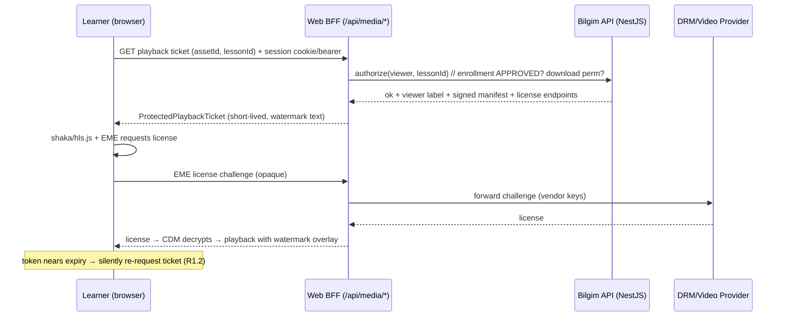

# Design Document

> **Bilgim Frontend (Web) Redesign & Completion — Technical Design**
> Companion to `requirements.md` in this spec. Grounds every decision in the existing `apps/web` (Next.js 14 App Router) implementation and the `apps/api` REST surface.

## Overview

This design turns the 21 requirements into an implementable frontend architecture for `apps/web`. It has three pillars:

1. **Content Protection (R1–R4)** — upgrade from the current "HLS proxy + JS deterrence" baseline to a **layered, provider-backed anti-piracy system** (multi-DRM + per-viewer forensic watermark + hardened download gating + best-effort deterrence), with an honest, documented limit that web capture cannot be 100% blocked.
2. **Design System Modernization (R5)** — unify the whole app on the existing **Bilgim Design System v2.0 (Apple Liquid Glass Light, primary `#0071E3`, Inter + Syne)**, retire the dark/`cream`-themed surfaces and the outdated Pomelo/Forest `web-design.md`, and introduce a documented component library + dark mode.
3. **Surface Completion (R6–R21)** — bring every role surface (teacher, student, admin, marketing) to a consistent, complete, accessible, localized, performant standard against the existing API.

### 1.1 Current-state findings (audited)

| Area | Current implementation | Gap vs requirements |
|------|------------------------|---------------------|
| Video playback | `components/lesson/hls-player.tsx` (hls.js) via `app/api/media/proxy/route.ts` proxy that hides R2 URLs and signs segments | No DRM/EME encryption; no forensic watermark; stream is decryptable from the proxied segments |
| Download gating | `lesson-player.tsx` gates the explicit download button when `attachment.caption === 'restrict'` | **Signed `preview.url` is still injected into ``, `<video src>`, `<iframe src>` in the DOM** → a restricted file is still reachable; gating is cosmetic |
| Deterrence | `hooks/use-content-protection.ts`, `hooks/use-screen-capture-detection.ts` | Good baseline; not wired into a single enforced media shell; not honest about limits in UI |
| Live | mediasoup via `hooks/use-live-session.ts`, `hooks/use-classroom.ts` (socket.io) | Works; needs watermark overlay on viewer + recording→lesson surfacing |
| Theming | Dashboard/marketing use Apple Liquid Glass light tokens; **lesson player + some surfaces use a dark `cream`/`ink-surface`/`accent2` theme** | Inconsistent; must unify on the design system + add dark mode as an explicit theme |
| Data layer | `lib/api-client.ts` (REST, bearer, refresh-and-retry), TanStack Query + SWR | Solid; reuse as-is |

### 1.2 Non-goals

- Re-architecting the backend (covered by `edubridge-platform` / `english-only-platform-refocus` specs). Where protected playback needs new API behavior (DRM license proxy, watermark token, signed-URL hardening), this design specifies the **frontend contract** and flags the backend dependency.
- The native mobile app (`apps/mobile`) — referenced only where OS-level protection differs (Open Question 4).

## Architecture

### 2.1 High-level

```
apps/web (Next.js 14 App Router)
├── app/[locale]/(marketing)      — public, SSR/SEO
├── app/[locale]/(auth)           — login/register/verify/reset
├── app/[locale]/(dashboard)      — teacher/student/admin shell (sidebar + topnav)
├── app/[locale]/(dashboard-full) — immersive (ai-chat)
├── app/[locale]/(live)           — live studio/viewer (full-bleed)
├── app/api/media/proxy           — media edge proxy (BFF) → hardened for protection
│
├── components/                   — UI: ui/ (primitives), dashboard/, student/,
│                                    lesson/, live/, homework/, gamification/, media/(NEW)
├── lib/
│   ├── api-client.ts             — REST client (reuse)
│   ├── api/*                     — typed endpoint wrappers (reuse/extend)
│   ├── design/tokens.ts (NEW)    — token source of truth bridge
│   └── media/protection/*  (NEW) — provider-agnostic protection abstraction
├── hooks/                        — use-content-protection, use-screen-capture-detection,
│                                    use-live-session, + use-protected-media (NEW)
└── providers/                    — QueryProvider, ThemeProvider (NEW), i18n
```

### 2.2 Rendering & data strategy

- **Server Components by default** for marketing, SEO pages, and initial dashboard shells; **Client Components** for interactive widgets (player, live, charts, forms).
- **Data fetching:** keep TanStack Query for authenticated client data (caching, optimistic updates, invalidation) and server fetches for public/SSR pages. No new data library.
- **Auth:** unchanged — `lib/api-client.ts` bearer + single refresh-and-retry on 401; `requireAuth` on server.
- **Real-time (R14.4):** existing socket.io transport (used by live/classroom) extended to notifications, DM, requests, and presence via a single typed socket hook.

## 3. Content Protection Architecture (R1–R4) — the critical pillar

### 3.1 Threat model & honest limits

| Threat | Mitigation layer | Realistic effectiveness |
|--------|------------------|-------------------------|
| Direct file download / URL sharing | Signed, short-lived playback tokens; no permanent media URL in DOM | High |
| Extracting raw video from network | Multi-DRM encryption (Widevine/FairPlay/PlayReady) via EME | High |
| Screen recording (desktop browser) | Hardware DRM (black frame on supported OS) + visibility pause + watermark | Partial (~70–80% Win; weak on Chrome/macOS) |
| Screenshot | Hardware DRM black frame (some OS) + watermark | Partial |
| External camera filming the screen | **Not technically preventable** | Watermark makes it **traceable** |
| Leaked & re-uploaded video | Per-viewer forensic watermark | Traceable → accountability/DMCA |

**Design principle:** make piracy *impractical and traceable*, never claim *impossible*. R1.6 requires we surface this honestly to instructors.

### 3.2 Provider-agnostic protection abstraction (NEW `lib/media/protection`)

To avoid lock-in and keep the player clean, all protection concerns sit behind one interface. A managed multi-DRM + watermark provider is recommended (see Decision D1) but swappable.

```ts
// lib/media/protection/types.ts
export interface ProtectedPlaybackRequest {
  assetId: string;
  lessonId: string;
  // viewer identity is resolved server-side from the session, never trusted from client
}

export interface ProtectedPlaybackTicket {
  manifestUrl: string;            // DRM-protected HLS/DASH manifest (short-lived)
  drm: {
    widevine?: { licenseUrl: string };
    fairplay?: { licenseUrl: string; certificateUrl: string };
    playready?: { licenseUrl: string };
  };
  watermark: {
    text: string;                 // server-rendered per-viewer label (masked email/id)
    sessionTag?: string;          // provider forensic session id (if supported)
  };
  expiresAt: string;              // ISO; client re-requests before expiry
  downloadAllowed: boolean;       // mirrors Group Download_Permission (server-authoritative)
}

export interface MediaProtectionProvider {
  getPlaybackTicket(req: ProtectedPlaybackRequest): Promise<ProtectedPlaybackTicket>;
  // returns a license response for an EME message (proxied through our API)
  getLicense(input: { assetId: string; keySystem: KeySystem; body: ArrayBuffer }): Promise<ArrayBuffer>;
}
```

- Frontend never talks to the DRM vendor directly; it calls **our API** (`/media/...`), which holds vendor keys and enforces enrollment + Download_Permission server-side (R1.2, R1.3, R2.4).
- The existing `app/api/media/proxy/route.ts` evolves into the **license/manifest broker** (BFF) so vendor URLs/keys never reach the browser.

### 3.3 Protected playback flow



### 3.4 Player redesign (`components/lesson/`)

- Replace the plain `hls.js`-via-proxy `HlsPlayer` with a **DRM-capable player** built on **Shaka Player** (mature multi-DRM/EME, Widevine + PlayReady) plus **FairPlay** path for Safari; hls.js remains a fallback only for non-DRM/public previews.
- New `ProtectedVideoPlayer` composes:
  - `useProtectedMedia(assetId, lessonId)` — fetches the ticket, manages EME via the provider abstraction, handles silent re-auth on expiry, fails **closed** if DRM can't init (R1.7).
  - `<WatermarkOverlay />` — absolutely-positioned, pointer-events-none layer rendering `ticket.watermark.text` + timestamp, repositioning on an interval, above the video (R3).
  - `<CaptureGuard />` — wraps `useScreenCaptureDetection` + `useContentProtection`; pauses + blurs on visibility loss / detected capture (R4.2–R4.3).
  - Learning controls (speed, captions, resume position) with **no** `download` in `controlsList` (R1.4, R6.3).
- Theme: rebuilt on the **light Apple Liquid Glass** tokens (retire `cream`/`ink-surface`/`accent2`), with a dark-mode variant.

### 3.5 Hardened download gating (fixes current leak — R2)

Current bug: restricted attachments still inject the signed URL into the DOM. New rules:

1. The BFF returns a viewable **stream** (proxied bytes) — not the signed source URL — for restricted content; the client `src` points at our proxy endpoint, not the vendor URL.
2. When `downloadAllowed === false`: render no download/print/"open in new tab" affordance; render PDFs/DOCs in a **protected viewer** (render to canvas / proxied iframe with toolbar disabled and `Content-Disposition: inline`), disable selection/print (R2.2, R2.5).
3. When `downloadAllowed === true`: reveal a download action that streams through the BFF with `Content-Disposition: attachment` (R2.3).
4. Authorization is enforced server-side on every fetch; the client treats `downloadAllowed` as display-only (R2.4).
5. Images/audio for restricted content are also proxied (no raw URL), `draggable=false`, context-menu disabled.

### 3.6 Deterrence module (R4) — honest, accessibility-safe

- Centralize the existing hooks into a `<ProtectedSurface>` wrapper applied to lesson/live routes (`data-content-protected` already used at `lessons/[id]`).
- Pause + obscure on blur/visibility loss; best-effort `getDisplayMedia`/virtual-display detection → warning + pause.
- A persistent, subtle "Protected content — captures are watermarked & traceable" notice (R4.4).
- **Must not** block assistive tech or trap keyboard; deterrent animations respect `prefers-reduced-motion` (R4.5).

### 3.7 Mobile asymmetry (Open Question 4)

Web is best-effort; the native app (`apps/mobile`) can add Android `FLAG_SECURE` and iOS capture detection for materially stronger protection. The web UI will recommend the app for highest-value content where appropriate.

## 4. Design System & Theming (R5)

### 4.1 Token source of truth

- Tokens already live in `tailwind.config.ts` + CSS vars in `globals.css` (surfaces, brand blue/green/orange/red/purple/teal, ink hierarchy, hero gradient, radius `1rem`, shadows `soft/medium/large`, motion). This stays the single source; a thin `lib/design/tokens.ts` re-exports semantic names for JS usage (charts, canvas watermark).
- **Semantic layering:** components consume *semantic* tokens (`--bg-canvas`, `--ink-strong`, `--blue`, `border-rim`) — never raw hex — so dark mode and future themes flip one layer.

### 4.2 Dark mode (R5.6)

- `next-themes`-style `ThemeProvider` toggling a `dark` class (Tailwind `darkMode: ['class']` already set). Default = OS preference.
- Add `:root .dark { ... }` CSS-var overrides (surfaces invert: `#0B0B0F` base, elevated panels, ink inverts; brand hues keep AA contrast). Audit every component in both themes (R19.3).

### 4.3 Typography & motion

- Inter (UI/body) + Syne (display headings, weight 800) — already loaded. Heading scale via `font-display`.
- Motion: standardized durations/easings as tokens; `framer-motion` for orchestrated transitions; **all motion gated by `prefers-reduced-motion`** (R5.5, R19.4).

### 4.4 Component library (`components/ui/`)

Consolidate/expand the shadcn-style primitives into a documented set with variants/sizes (R5.4):

`Button` (primary/secondary/ghost/danger · sm/md/lg) · `Input/Textarea/Select/Switch/Checkbox/RadioCard` · `Card` (+ `StatCard`, `BentoCard`) · `Tabs` · `Modal/Dialog` · `Drawer/Sheet` · `Toast` (sonner) · `Table` (sort/filter/paginate) · `Skeleton` · `EmptyState` · `Badge/StatusPill` · `Avatar` · `Tooltip` · `ProgressBar` · `Stepper` · `Charts` (area/donut/bar SVG, already patterned in teacher-dashboard). Each: light + dark, keyboard-accessible, RTL-safe spacing.

### 4.5 App shell

- Reuse `(dashboard)/layout.tsx` shell (sidebar `components/dashboard/sidebar.tsx` + `top-nav.tsx`), refined to tokens; role-aware nav already implemented. Add: command palette (⌘K) for power users (2026 pattern), theme toggle, locale switch, notification center, global search.
- Mobile: sidebar → bottom tab bar / drawer (R18.2).

## 5. Surface Designs (R6–R17)

Each surface is a thin Server Component page + Client widgets, reusing typed `lib/api/*` wrappers. Summary of net-new/changed work:

- **Lesson player (R6):** new `ProtectedVideoPlayer` (§3.4); recordings of ENDED live sessions surfaced in the lesson via the lesson's recordings relation; server-side progress endpoint replaces the current `localStorage` "mark watched" stopgap.
- **Live (R7):** keep mediasoup hooks; restyle `Live_Studio`/`Live_Viewer` to tokens; add recording indicator, participant/chat panels, watermark overlay on viewer, RECORDING_FAILED messaging, reconnect status.
- **Teacher authoring (R8–R9):** course/group/lesson editors with lesson-type cards (RECORDED/LIVE/HYBRID/TEXT_ONLY), resumable uploads (progress + retry), RRULE schedule editor, group settings incl. **Download_Permission** toggle + module toggles, invite links/join codes, requests queue with optimistic approve/reject.
- **Homework (R10):** per-skill submission UIs (writing rich-text, reading passage+items, listening audio, grammar/vocab/spelling interactive, speaking/pronunciation audio recorder); autosave states; teacher grading queue with AI-draft + AI-likelihood surfaced (components exist: `homework/teacher-submission-review.tsx`, `student-assignment-detail.tsx` — restyle + complete).
- **BilgimAI (R11):** streaming chat, intent selector, rate-limit display, purple AI accent; entry from shell.
- **Gamification (R12):** XP/streak in shell; achievements/leaderboard/rewards views (components exist under `components/gamification/` — restyle + complete); level-up affirmation (reduced-motion safe).
- **Billing (R13):** subscription state cards, plans comparison (UZS), Payme redirect, invoices, restriction messaging.
- **Notifications & DM (R14):** notification center + DM, real-time via socket; channel preferences.
- **Marketing & discovery (R15):** modernize landing/pricing/about/FAQ/legal; discovery filter by CEFR/Exam_Track; public instructor profiles; SSR + metadata. **Note:** current marketing/discovery uses a dark `accent2` theme — align to the unified system.
- **Auth & onboarding (R16):** register/login/verify/reset with localized API error catalog; English-focused instructor onboarding; MFA enroll/challenge.
- **Admin (R17):** dashboard KPIs; users/specialties(→English catalog)/CMS/AI prompts/plans/audit tables with confirm-destructive patterns.

## 6. Cross-cutting design

### 6.1 i18n (R21)
`next-intl` with `uz` (default) / `ru` / `en` from `packages/i18n`; no hard-coded strings; locale-aware number/UZS/date formatting (Asia/Tashkent); tri-lingual entity fields rendered by active locale. Locale switch persists.

### 6.2 Accessibility (R19)
Semantic HTML, ARIA, full keyboard support, visible focus rings, AA contrast in both themes, reduced-motion. Automated checks (axe in CI) **plus** manual screen-reader audits (documented as required, not sufficient alone).

### 6.3 Performance (R20)
RSC-first, route-level code splitting, `next/image` (AVIF/WebP), font preload, skeletons + optimistic UI for every data view; Core Web Vitals budget tracked. Player/live chunks dynamically imported.

### 6.4 Error/empty/loading states
Every data-backed view defines all four states (loading skeleton, empty with CTA, error with retry, success). API errors surfaced via the `ApiClientError` envelope (`error.code/message`), mapped to localized copy.

## 7. Requirements traceability

| Requirement | Design section |
|---|---|
| R1 Protected playback | §3.2–§3.4 |
| R2 Download gating | §3.5 |
| R3 Forensic watermark | §3.2, §3.4 (`WatermarkOverlay`) |
| R4 Capture deterrence | §3.6 |
| R5 Design system | §4 |
| R6 Lesson player/recordings | §3.4, §5 |
| R7 Live | §5 |
| R8 Authoring | §5 |
| R9 Enrollment/requests | §5 |
| R10 Homework | §5 |
| R11 BilgimAI | §5 |
| R12 Gamification | §5 |
| R13 Billing | §5 |
| R14 Notifications/DM | §2.2, §5 |
| R15 Marketing/discovery | §5 |
| R16 Auth/onboarding | §5 |
| R17 Admin | §5 |
| R18 Responsive | §4.5 |
| R19 a11y | §6.2 |
| R20 performance | §6.3 |
| R21 i18n | §6.1 |

## 8. Key decisions

- **D1 — DRM/video provider (recommended): a managed multi-DRM + dynamic-watermark provider (VdoCipher or Gumlet).** Rationale: self-hosting FairPlay licensing + multi-DRM + forensic watermarking is high-effort and risky; managed providers deliver Widevine/FairPlay/PlayReady + per-viewer watermark out of the box at accessible pricing (2026). The `MediaProtectionProvider` interface (§3.2) keeps it swappable (incl. a future self-hosted option). **Depends on the user choosing a provider + supplying keys (Open Question 1).**
- **D2 — Player engine: Shaka Player** for Widevine/PlayReady/DASH + EME, with a FairPlay/HLS path for Safari; hls.js retained only for non-DRM/public previews.
- **D3 — BFF brokers all media:** `app/api/media/*` holds vendor keys, signs/expires manifests, proxies EME license challenges, and streams restricted files; the browser never sees vendor URLs/keys (closes the §3.5 leak).
- **D4 — Theme unification on Apple Liquid Glass Light** (+ dark mode); retire `cream`/`ink-surface`/`accent2` dark surfaces and the Pomelo/Forest `web-design.md`.
- **D5 — Reuse existing data/auth/real-time stack** (api-client, TanStack Query, socket.io); no new core libraries beyond the player + theme provider.

## 9. Risks & dependencies

1. **DRM provider selection & cost** (Open Q1) blocks full R1/R3 verification; until chosen, build against the `MediaProtectionProvider` interface with a mock + the current proxy as fallback.
2. **FairPlay/Safari** needs certificate setup (Open Q3); web iOS protection may lag the native app.
3. **Backend contracts** for playback tickets, license proxying, watermark labels, and hardened restricted-file streaming must be added/confirmed in `apps/api` (frontend contract defined in §3.2/§3.5).
4. **Honest-limits messaging** must ship with the feature so instructors aren't misled (R1.6).

## Components and Interfaces

Net-new and changed components (detail in §3–§5):

| Component / module | Type | Responsibility |
|---|---|---|
| `lib/media/protection/*` (`MediaProtectionProvider`) | TS interface + adapters | Vendor-agnostic playback ticket + EME license brokering (§3.2) |
| `app/api/media/*` (BFF) | Route handlers | Hold vendor keys, sign/expire manifests, proxy license challenges, stream restricted files (§3.3, D3) |
| `hooks/use-protected-media.ts` | Client hook | Fetch ticket, drive EME via Shaka, silent re-auth, fail-closed (§3.4) |
| `components/lesson/ProtectedVideoPlayer` | Client | DRM player + controls (no download) |
| `components/media/WatermarkOverlay` | Client | Per-viewer moving overlay above video (R3) |
| `components/media/CaptureGuard` / `ProtectedSurface` | Client | Wrap deterrence hooks; pause+obscure on blur/capture (R4) |
| `components/media/ProtectedFileViewer` | Client | Render PDF/DOC/image via proxy, no raw URL, gated by `downloadAllowed` (§3.5) |
| `providers/ThemeProvider` | Client | Light/dark theme via `dark` class (R5.6) |
| `components/ui/*` | Client | Documented primitive library, light+dark, a11y (§4.4) |
| `hooks/use-realtime.ts` | Client | Single socket.io hook for notifications/DM/requests/presence (R14.4) |

**External API contract (frontend → Bilgim API), to confirm with backend:** `GET /media/assets/:id/playback-ticket` → `ProtectedPlaybackTicket`; `POST /media/assets/:id/license` (EME proxy); `GET /media/assets/:id/stream` (gated restricted-file bytes); group `downloadAllowed` on group-settings DTO.

## Data Models

The frontend introduces **no new database models** — it consumes existing API DTOs derived from `packages/db/prisma/schema.prisma` (User, Course, Group, Lesson, Attachment, MediaAsset, LiveSession, Recording, Assignment, Submission, Subscription, Notification, GamificationProfile, etc.).

Frontend-only view/transport models:
- `ProtectedPlaybackTicket`, `ProtectedPlaybackRequest` (§3.2) — playback session contract.
- View-models for dashboard widgets (already typed in `lib/api/teacher-analytics.ts`, `lib/api/student.ts`).
- `Theme = 'light' | 'dark' | 'system'`, `Locale = 'uz' | 'ru' | 'en'` (persisted client prefs).
- Server-authoritative fields the client treats as display-only: `downloadAllowed`, enrollment `status`, subscription `status`.

## Correctness Properties

Invariants the implementation must uphold (testable):

### Property 1: Fail-closed playback
If DRM/EME cannot initialize, the player never falls back to an unprotected source (R1.7).
**Validates: Requirements 1.7**

### Property 2: No vendor secret in client
No DRM key, vendor URL, or permanent media URL is ever present in client JS/DOM/network responses to the browser (D3, §3.5).
**Validates: Requirements 1.1, 2.4**

### Property 3: Server-authoritative gating
Hiding a download control never substitutes for API authorization; a tampered client cannot fetch restricted bytes (R2.4).
**Validates: Requirements 2.4**

### Property 4: Watermark binding
Watermark text is derived from the authenticated session server-side; the client cannot remove/forge it without breaking playback (R3.3).
**Validates: Requirements 3.1, 3.3**

### Property 5: Token freshness
Playback proceeds only with an unexpired ticket; expiry triggers silent re-auth, not exposure of a long-lived URL (R1.2).
**Validates: Requirements 1.2**

### Property 6: Role isolation
Role-restricted routes never render for the wrong role (R16.5).
**Validates: Requirements 16.5**

### Property 7: Reduced-motion & a11y safety
Deterrence/animation never disables assistive tech or keyboard navigation (R4.5, R19).
**Validates: Requirements 4.5, 19.4**

## Error Handling

- **API errors:** unwrap `ApiClientError` envelope (`error.code/message`) → localized copy; every data view renders loading/empty/error/success (§6.4).
- **DRM/license errors:** distinguish unsupported-browser, license-denied (no entitlement), and transient failures; show actionable guidance (use supported browser / mobile app); fail closed.
- **Token expiry:** silent re-request; on repeated failure, pause with a clear re-auth prompt.
- **Capture detected / focus lost:** pause + obscure + non-alarming notice; resume on return.
- **Upload errors (R8.4):** chunked uploads expose per-chunk retry and resumable state.
- **Live disconnects (R7.6):** auto-reconnect with visible status; RECORDING_FAILED messaging (R7.5).
- **Auth/session loss:** graceful redirect to login preserving intended destination where possible.

## Testing Strategy

- **Unit:** protection abstraction (ticket lifecycle, expiry, fail-closed), token/locale/theme utilities, formatters.
- **Component (RTL/jest — already configured):** player states, watermark presence, download-gating shows/hides correctly, role guards, homework skill UIs, empty/error states.
- **Integration/e2e:** protected playback happy path with a mock `MediaProtectionProvider`; restricted file cannot be fetched without permission (negative test asserting no raw URL in DOM/network); enrollment-gated access; auth flows.
- **Accessibility:** automated `axe` in CI **plus** documented manual screen-reader + keyboard audits (R19.5).
- **Visual/theme:** light + dark snapshot/visual checks for the component library.
- **Manual security validation:** documented checklist for capture/screenshot behavior across Win/macOS + Chrome/Safari (records the honest partial-effectiveness results), executed once a DRM provider is wired (Risk 1).
