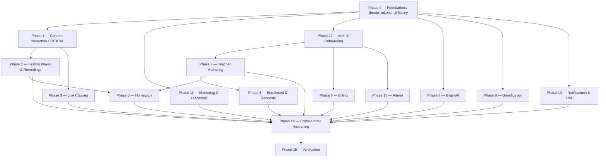

# Implementation Plan

> Frontend (web) redesign & completion for `apps/web`. Tasks are incremental and test-backed. Content protection (Phase 1) is prioritized as the most business-critical work. Each task lists the requirements it satisfies. Verify with `pnpm --filter @bilgim/web typecheck` + `test` (and `build`) after each phase.

## Overview

This plan completes and modernizes the `apps/web` frontend in 16 phases. Phase 0 establishes theming and the component library; **Phase 1 (content protection) is the critical path** and should be implemented and verified before broad surface rollout; Phases 2–13 complete each product surface; Phases 14–15 harden cross-cutting concerns and verify the whole. Tasks are incremental, test-backed, and traceable to `requirements.md`.

## Tasks

## Phase 0 — Foundations

- [x] 0.1 Add `ThemeProvider` (light/dark/system) and wire `dark` class + CSS-var overrides in `globals.css`; add theme toggle to the app shell.
  - _Requirements: 5.1, 5.6_
- [x] 0.2 Create `lib/design/tokens.ts` semantic-token bridge for JS consumers (charts, watermark canvas); refactor components to use semantic tokens, not raw hex.
  - _Requirements: 5.2_
- [x] 0.3 Consolidate `components/ui/*` primitive library (Button, Input, Select, Switch, Checkbox, RadioCard, Card/StatCard, Tabs, Modal, Drawer, Toast, Table, Skeleton, EmptyState, Badge/StatusPill, Avatar, Tooltip, ProgressBar, Stepper) with documented variants, light+dark, keyboard a11y.
  - _Requirements: 5.4, 19.1, 19.2_
- [x] 0.4 Add reusable state components (loading skeleton, empty-with-CTA, error-with-retry) and a `useRealtime` socket hook scaffold.
  - _Requirements: 20.3, 14.4_

## Phase 1 — Content protection (CRITICAL)

- [x] 1.1 Define `lib/media/protection` types and `MediaProtectionProvider` interface (`ProtectedPlaybackRequest`, `ProtectedPlaybackTicket`); add a mock adapter for development.
  - _Requirements: 1.1, 1.2, 3.1_
- [x] 1.2 Evolve `app/api/media/proxy/route.ts` into the media BFF: playback-ticket endpoint, EME license proxy, and gated restricted-file streaming; never expose vendor URLs/keys to the browser. (Coordinate the API contract with backend.)
  - _Requirements: 1.1, 1.2, 1.3, 2.4_
- [x] 1.3 Build `useProtectedMedia` hook + `ProtectedVideoPlayer` on Shaka Player (Widevine/PlayReady/EME) with a FairPlay path for Safari; hls.js only for non-DRM public previews; **fail closed** if DRM can't init.
  - _Requirements: 1.1, 1.4, 1.5, 1.7_
- [x] 1.4 Implement `WatermarkOverlay` (per-viewer label + timestamp, repositioning, above video, server-derived text) for recorded and live playback.
  - _Requirements: 3.1, 3.2, 3.3, 3.5_
- [x] 1.5 Implement `CaptureGuard`/`ProtectedSurface` consolidating `use-content-protection` + `use-screen-capture-detection`: pause+obscure on blur/visibility/capture, accessibility-safe, reduced-motion safe.
  - _Requirements: 4.1, 4.2, 4.3, 4.5_
- [x] 1.6 Harden download gating: `ProtectedFileViewer` streams PDFs/DOC/images/audio through the BFF (no raw signed URL in DOM), disable print/selection when `downloadAllowed` is false; reveal streamed download only when true. **Fix the current `lesson-player.tsx` URL-leak.**
  - _Requirements: 2.1, 2.2, 2.3, 2.4, 2.5_
- [x] 1.7 Add honest "protected & traceable" messaging for learners and an instructor-facing explainer of web capture limits; document the limitation.
  - _Requirements: 1.6, 4.4_
- [x] 1.8 Tests: ticket lifecycle/expiry/fail-closed (unit); watermark presence + gating show/hide (component); negative e2e asserting restricted bytes/URL are unreachable without permission.
  - _Requirements: 1.1, 1.7, 2.4, 3.1_

## Phase 2 — Lesson player & recordings

- [x] 2.1 Rebuild `components/lesson/lesson-player.tsx` on the light design system using `ProtectedVideoPlayer`; retire `cream`/`ink-surface`/`accent2` dark theme here.
  - _Requirements: 5.1, 5.7, 6.1, 6.3_
- [x] 2.2 Surface ENDED live-session recordings inside the corresponding lesson for on-demand viewing.
  - _Requirements: 6.2_
- [x] 2.3 Replace `localStorage` "mark watched" with a server-side progress call; add lesson navigation (prev/next, group lesson list, lock state).
  - _Requirements: 6.4, 6.6_
- [x] 2.4 Render lesson attachments via `ProtectedFileViewer` gated by Download_Permission.
  - _Requirements: 6.5, 2.2_

## Phase 3 — Live classes

- [x] 3.1 Restyle `Live_Studio` (camera/mic/screen controls, recording indicator, participant list, live chat, quality/connection state) to the design system.
  - _Requirements: 7.1, 7.2_
- [x] 3.2 Restyle `Live_Viewer` (APPROVED-only join, stream + chat) and apply `WatermarkOverlay`.
  - _Requirements: 7.3, 3.5_
- [x] 3.3 Handle recording finalization surfacing, RECORDING_FAILED messaging, and reconnect status.
  - _Requirements: 7.4, 7.5, 7.6_

## Phase 4 — Teacher authoring

- [x] 4.1 Course create/edit (title, description, cover, CEFR level, optional Exam_Track; no specialty step).
  - _Requirements: 8.1_
- [x] 4.2 Group create/edit (level, capacity, schedule, UZS price, join/invite controls) under a course.
  - _Requirements: 8.2_
- [x] 4.3 Lesson editor with type cards (RECORDED/LIVE/HYBRID/TEXT_ONLY) and type-appropriate authoring; rich-text for TEXT_ONLY.
  - _Requirements: 8.3_
- [x] 4.4 Resumable/chunked upload UX with progress + retry for videos/attachments.
  - _Requirements: 8.4_
- [x] 4.5 RRULE schedule editor (Asia/Tashkent) with exceptions/cancellations.
  - _Requirements: 8.5_
- [x] 4.6 Group settings: **Download_Permission** toggle + homework module toggles.
  - _Requirements: 8.6, 2.1_
- [x] 4.7 Publishing-blocked messaging while subscription EXPIRED/CANCELED, linking to billing.
  - _Requirements: 8.7_

## Phase 5 — Enrollment, invites & requests

- [x] 5.1 Invite links (expiry/usage limits) + join codes; invite landing routes to register/login + Payme/enrollment.
  - _Requirements: 9.1, 9.2_
- [x] 5.2 Instructor requests queue with optimistic approve/reject and live nav counts.
  - _Requirements: 9.3, 9.4_
- [x] 5.3 Learner enrollment status display (pending payment/approval, approved, rejected).
  - _Requirements: 9.5_

## Phase 6 — Homework

- [x] 6.1 Assignment builder from enabled English skill modules (due date, points).
  - _Requirements: 10.1_
- [x] 6.2 Per-skill learner UIs (writing/reading/listening/grammar/vocab/spelling/speaking+pronunciation audio) with autosave states.
  - _Requirements: 10.2, 10.3_
- [x] 6.3 Audio submission upload (protected MediaAsset) + AI scoring status display.
  - _Requirements: 10.4_
- [x] 6.4 Teacher grading queue (filter by status, AI-draft + AI-likelihood) with adjust/finalize; learner score+feedback view.
  - _Requirements: 10.5, 10.6_

## Phase 7 — BilgimAI

- [x] 7.1 Streaming chat surface with intents, rate-limit display, purple accent, hint-only messaging, consistent entry point.
  - _Requirements: 11.1, 11.2, 11.3, 11.4, 11.5_

## Phase 8 — Gamification

- [x] 8.1 XP/level/streak in shell; level-up affirmation (reduced-motion safe).
  - _Requirements: 12.1, 12.2_
- [x] 8.2 Achievements (earned/locked + rarity), leaderboard, rewards shop, daily challenges — restyled to design system + localized.
  - _Requirements: 12.3, 12.4, 12.5_

## Phase 9 — Billing

- [x] 9.1 Subscription state cards + trial countdown; plans comparison (UZS) + Payme start/upgrade/cancel.
  - _Requirements: 13.1, 13.2_
- [x] 9.2 Invoice history; payment-required/failed states; PAST_DUE/EXPIRED restriction messaging.
  - _Requirements: 13.3, 13.4, 13.5_

## Phase 10 — Notifications & messaging

- [x] 10.1 Notification center (unread indicators, mark-as-read, kinds with deep links).
  - _Requirements: 14.1, 14.2_
- [x] 10.2 Direct messaging (unread counts, real-time) + channel preferences.
  - _Requirements: 14.3, 14.4, 14.5_

## Phase 11 — Marketing & discovery

- [x] 11.1 Modernize landing/pricing/about/FAQ/legal to the unified design system (retire dark `accent2` theme), conversion-focused, SSR + metadata.
  - _Requirements: 15.1, 15.4_
- [x] 11.2 Discovery/search filtered by CEFR/Exam_Track; public instructor profiles; enroll routing.
  - _Requirements: 15.2, 15.3, 15.5_

## Phase 12 — Auth & onboarding

- [x] 12.1 Register (role select)/login/verify/forgot/reset with localized API error catalog.
  - _Requirements: 16.1_
- [x] 12.2 English-focused instructor onboarding (CEFR/Exam_Track), route to dashboard.
  - _Requirements: 16.2_
- [x] 12.3 MFA enroll/challenge (TOTP/WebAuthn) + backup codes; graceful session-expiry handling; role-route guards.
  - _Requirements: 16.3, 16.4, 16.5_

## Phase 13 — Admin

- [x] 13.1 Admin dashboard KPIs + recent activity.
  - _Requirements: 17.1_
- [x] 13.2 Management tables (users, English module catalog/Exam_Track, CMS, AI prompts, plans, audit) with sort/filter/paginate + confirm-destructive.
  - _Requirements: 17.2, 17.3, 17.4_

## Phase 14 — Cross-cutting hardening

- [x] 14.1 Responsive pass: sidebar→bottom tab/drawer, 44px touch targets, mobile player/live.
  - _Requirements: 18.1, 18.2, 18.3, 18.4_
- [x] 14.2 Accessibility pass: semantics/ARIA, keyboard, AA contrast (light+dark), reduced-motion; axe in CI + documented manual SR audit.
  - _Requirements: 19.1, 19.2, 19.3, 19.4, 19.5_
- [x] 14.3 Performance pass: RSC/code-split, image optimization, font preload, skeletons/optimistic UI, Core Web Vitals budget.
  - _Requirements: 20.1, 20.2, 20.3, 20.4_
- [x] 14.4 i18n pass: extract all strings to `packages/i18n` (uz/ru/en), locale-aware UZS/date formatting, tri-lingual entity rendering, persistent locale switch.
  - _Requirements: 21.1, 21.2, 21.3, 21.4_

## Phase 15 — Verification

- [x] 15.1 Full `typecheck` + `test` + `build` green across the web app.
  - _Requirements: 20.1_
- [ ] 15.2 Execute and record the manual content-protection checklist (Win/macOS × Chrome/Safari), documenting honest partial-effectiveness, once a DRM provider (Open Q1) is wired.
  - _Requirements: 1.5, 1.6, 4.3_

## Task Dependency Graph



Execution waves (tasks within a wave can run in parallel; later waves depend on earlier ones):

```json
{
  "waves": [
    { "wave": 1, "name": "Foundations", "tasks": ["0.1", "0.2", "0.3", "0.4"] },
    { "wave": 2, "name": "Content Protection (critical)", "tasks": ["1.1", "1.2", "1.3", "1.4", "1.5", "1.6", "1.7", "1.8"] },
    { "wave": 3, "name": "Auth & public surfaces", "tasks": ["11.1", "11.2", "12.1", "12.2", "12.3"] },
    { "wave": 4, "name": "Protected media surfaces", "tasks": ["2.1", "2.2", "2.3", "2.4", "3.1", "3.2", "3.3"] },
    { "wave": 5, "name": "Teacher authoring & enrollment", "tasks": ["4.1", "4.2", "4.3", "4.4", "4.5", "4.6", "4.7", "5.1", "5.2", "5.3"] },
    { "wave": 6, "name": "Homework, AI, gamification, billing, comms, admin", "tasks": ["6.1", "6.2", "6.3", "6.4", "7.1", "8.1", "8.2", "9.1", "9.2", "10.1", "10.2", "13.1", "13.2"] },
    { "wave": 7, "name": "Cross-cutting hardening", "tasks": ["14.1", "14.2", "14.3", "14.4"] },
    { "wave": 8, "name": "Verification", "tasks": ["15.1", "15.2"] }
  ]
}
```

## Notes

- **Critical path:** Phase 0 → Phase 1 → (Phase 2 / Phase 3). Content protection gates the value proposition; do not roll protected content broadly until Phase 1 verification passes.
- **External dependency:** Phase 1 full verification (and Phase 15.2) require a chosen DRM/watermark provider + keys (requirements Open Question 1, design Decision D1). Until then, build against the `MediaProtectionProvider` mock with the existing proxy as fallback.
- **Backend coordination:** tasks 1.2/1.6 depend on API endpoints for playback tickets, EME license proxying, watermark labels, and hardened restricted-file streaming — confirm contracts with `apps/api` owners.
- **Honest-limits messaging (task 1.7) ships with the protection feature** so instructors are not misled about web capture prevention.
- Run `typecheck` + `test` after every task and `build` at each phase boundary; keep every data view's loading/empty/error/success states intact.