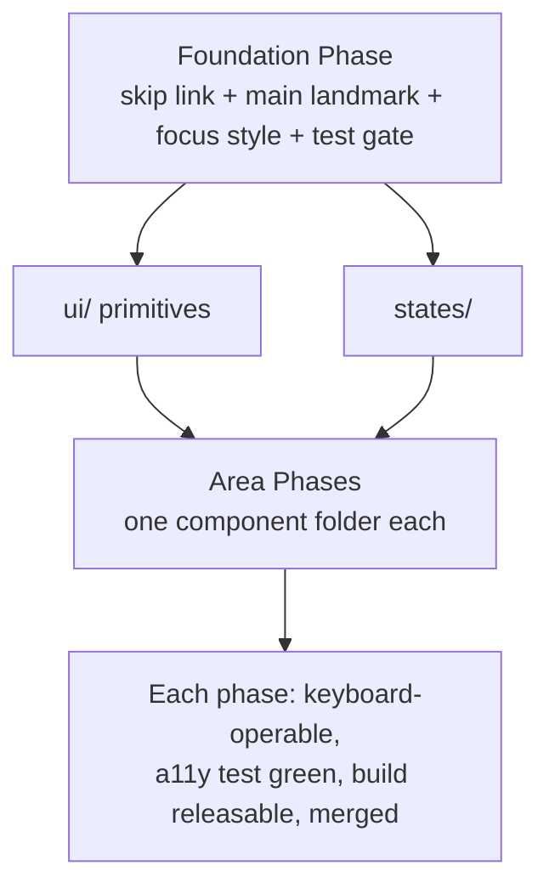
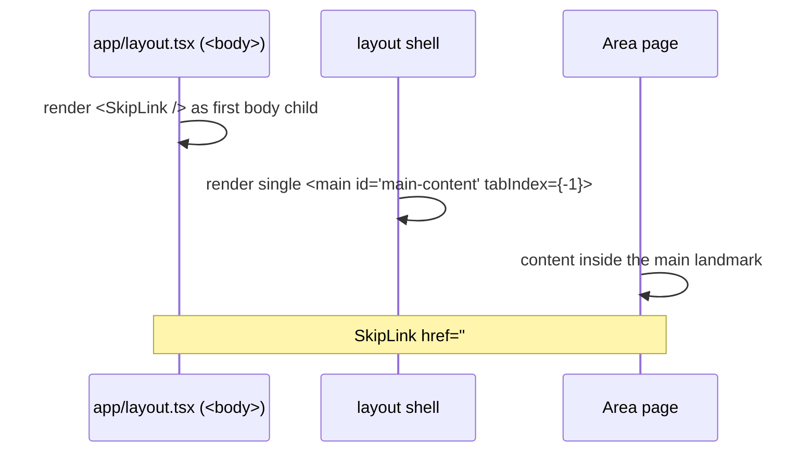

# Design Document

## Overview

This design makes `apps/web` fully operable with the **keyboard alone** — no
mouse or touchpad needed to reach, see, and operate every control. The scope is
deliberately minimal: keyboard reachability/operation, a visible focus
indicator, sane focus order, composite-widget arrow keys, overlay focus
management, and a lightweight automated check per area. Contrast, captions,
live-region announcements, reduced motion, and i18n metadata are out of scope.

Delivery is **phased** so the build is never touched all at once: one small
**Foundation phase** wires the shared keyboard spine, then one **Area phase**
per component folder, starting with shared primitives (`ui/`, `states/`) so
everything else inherits accessible building blocks.

The design **extends, never duplicates** existing groundwork:

- `components/a11y/skip-link.tsx` — exists, `sr-only` until focused, targets
  `#main-content`. Not yet mounted; Foundation mounts it.
- `lib/test/a11y.ts` — dependency-free detector
  (`findBasicA11yViolations` / `expectNoBasicA11yViolations`) that already flags
  `positive-tabindex` and `control-name`. Foundation reuses it as the per-area
  gate; no new test dependency is added.
- `app/globals.css` — has no global focus style today; Foundation adds one
  `:focus-visible` ring.

### Grounding notes

- **Radix already handles the hard parts.** The app uses Radix UI primitives
  (Dialog, Popover, Menu, Tabs, etc.), which provide focus trap, `Esc` to close,
  focus restore on close, and arrow-key roving for composite widgets out of the
  box. Area phases therefore **prefer Radix** and rarely need custom focus code.
- **A small custom-overlay gap.** Any overlay *not* built on Radix needs a focus
  trap. The design adds one tiny `useFocusTrap` hook for exactly that case.
- **`main` landmark + skip target.** No single focusable `<main id="main-content">`
  exists yet. The shared layout shell establishes one so the skip link has a
  target.

## Architecture

### Phased delivery model



Two phase kinds:

- **Foundation phase** (one, first): global keyboard wiring + the shared
  `useFocusTrap`/`focus.ts` utilities + confirm the test gate runs in CI.
- **Area phase** (one per folder under `apps/web/components/<area>`, plus any
  routes that area owns): make that area fully keyboard-operable against
  Requirements 3–7 and add its automated check (Req 8).

Each phase touches a **bounded file surface**, leaves the app building and
releasable (Req 1.4), and is independently mergeable (Req 1.3). No Area phase
depends on edits from another Area phase; shared fixes belong in Foundation or
the early `ui/` phase.

### Phase ordering

Shared primitives first (so areas compose already-accessible controls), then the
rest in a sensible traffic/criticality order.

| #  | Phase        | Area            | Why here |
|----|--------------|-----------------|----------|
| 0  | Foundation   | — (global)      | Skip link, `main` landmark, focus style, test gate, focus utils |
| 1  | ui           | `ui/`           | Shared Radix/shadcn primitives every area composes |
| 2  | states       | `states/`       | Loading/error/empty states reused across areas |
| 3  | auth         | `auth/`         | Critical entry flow; forms + overlays |
| 4  | dashboard    | `dashboard/`    | Primary authenticated surface; nav/sidebar |
| 5  | discovery    | `discovery/`    | Catalog browse & search |
| 6  | lesson       | `lesson/`       | Lesson detail + player controls |
| 7  | live         | `live/`         | Live join + top bar + chat |
| 8  | live-room    | `live-room/`    | Live viewer, whiteboard, controls |
| 9  | homework     | `homework/`     | Submit & feedback forms |
| 10 | billing      | `billing/`      | Checkout/enrollment forms |
| 11 | messages     | `messages/`     | Direct messages |
| 12 | notifications| `notifications/`| Inbox |
| 13 | gamification | `gamification/` | Points/achievements |
| 14 | ai           | `ai/`           | AI tutor controls |
| 15 | settings     | `settings/`     | Theme + language switch; forms |
| 16 | landing      | `landing/`      | Public entry |
| 17 | marketing    | `marketing/`    | Marketing surfaces |
| 18 | media        | `media/`        | Protected media controls |
| 19 | teacher      | `teacher/`      | Teacher tooling |
| 20 | student      | `student/`      | Student tooling |
| 21 | admin        | `admin/`        | Internal tooling |
| 22 | protection   | `protection/`   | Mostly static notices |

This list satisfies Req 1.1 and is the authoritative ordering for the tasks doc.

### Foundation-phase wiring



Foundation delivers, as one bounded phase:

1. **Mount the skip link** — `<SkipLink />` as the first focusable element inside
   `<body>` in `app/layout.tsx`, before any header (Req 2.1, 2.4).
2. **Single `<main id="main-content" tabIndex={-1}>`** — established in the shared
   layout shell so every page exposes exactly one main landmark and the skip link
   has a programmatic focus target (Req 2.2, 2.3). Nested layouts must not add a
   second `<main>`.
3. **Global visible focus indicator** — add a `:focus-visible` outline/ring rule
   to `app/globals.css` so every focusable element shows focus (Req 4.1). Uses
   the existing ring tokens already referenced by the skip link.
4. **Confirm the test gate** — ensure `lib/test/a11y.ts` checks run under
   `pnpm --filter @bilgim/web test` in CI (Req 8.3); extend the helper only for
   the keyboard-relevant rules (already has `positive-tabindex` and
   `control-name`).

Foundation does not remediate any individual area.

## Components and Interfaces

New utilities live under `apps/web/lib/a11y/`, alongside the existing
`components/a11y/skip-link.tsx`. They are additive and dependency-free.

### 1. Focus utilities (new)

```ts
// apps/web/lib/a11y/focus.ts

/** Move programmatic focus to an element by id (skip-link target + trap edges). */
export function focusById(id: string): void;
RDA
ARALASH
test
/** Ordered list of tabbable elements within a container (visible, not disabled,
 *  tabindex !== -1), in DOM/visual order. */
export function getTabbable(container: HTMLElement): HTMLElement[];
```

- `focusById('main-content')` is what the skip link activation resolves to; it is
  a no-op if the target is missing.
- `getTabbable` backs both the skip target logic and the focus trap.

### 2. Focus trap hook (new, for custom overlays only)

```ts
// apps/web/lib/a11y/use-focus-trap.ts

/** Trap Tab focus within `ref` while `active`; `Esc` calls onClose; restores
 *  focus to the previously-focused element when deactivated (Req 7.1–7.3). */
export function useFocusTrap(
  ref: React.RefObject<HTMLElement>,
  opts: { active: boolean; onClose?: () => void },
): void;
```

- **Radix Dialog/Popover/Menu already provide trap + `Esc` + focus restore**, so
  area phases prefer Radix and reach for this hook **only** for custom
  (non-Radix) overlays. It exists to cover that narrow gap, not to replace Radix.
- Uses `getTabbable(ref.current)` to find the first/last stops and wraps `Tab` /
  `Shift+Tab` at the edges.

### 3. Extended test helper (extends existing `lib/test/a11y.ts`)

No signature change for keyboard scope. The helper already detects the two rules
the keyboard checks require:

- `positive-tabindex` — fails when any element uses `tabindex > 0` (Req 5.2, 8.2).
- `control-name` — fails when a `<button>` / `<a href>` has no accessible name,
  the keyboard-relevant "every control is identifiable/operable" signal
  (Req 8.2).

Any extension is limited to keeping these two checks robust on partial DOM. We do
**not** add `jest-axe` or other a11y dependencies.

## Data Models

The feature is behavioral; only one small shape anchors it (already present).

### A11yViolation (existing, unchanged)

```ts
interface A11yViolation {
  readonly rule: string;   // e.g. "positive-tabindex", "control-name"
  readonly message: string;
  readonly html: string;   // truncated outerHTML for debugging
}
```

## Correctness Properties

*A property is a characteristic or behavior that should hold true across all
valid executions of a system — a formal statement about what the system should
do, suitable for machine verification.*

**Scope note.** This feature is almost entirely UI wiring (mounting a component,
setting `tabIndex`, composing Radix, adding a CSS focus rule). Those criteria are
best verified by simple render/example tests and are not amenable to
property-based testing. The one pure, input-varying surface is the **detector in
`lib/test/a11y.ts`** — specifically its `positive-tabindex` rule, which scans
arbitrary DOM. A single small property keeps that detector honest; everything
else uses example tests.

### Property 1: Positive-tabindex detection is sound and complete

*For any* generated DOM container, `findBasicA11yViolations` reports a
`positive-tabindex` violation **if and only if** the container contains at least
one element with a numeric `tabindex` greater than `0`; containers using only
`tabindex` values of `0` or `-1` (or none) yield no `positive-tabindex`
violation.

**Validates: Requirements 5.2, 8.2**

## Error Handling

- **Skip-link target missing.** `focusById('main-content')` is a no-op (dev-only
  log) if the element is absent. Foundation guarantees the target exists, so this
  is a safety net.
- **Focus trap with no tabbable children.** `useFocusTrap` keeps focus on the
  container itself (consumer gives it `tabIndex={-1}`) rather than letting focus
  escape or throwing.
- **Detector robustness.** `findBasicA11yViolations` must not throw on malformed
  or partial DOM; unknown nodes are skipped.

## Testing Strategy

Primarily example/render tests, plus the single detector property above. No new
test dependency; we reuse `lib/test/a11y.ts` and Testing Library (jsdom).

### Per Area phase (Req 8.1, 8.2)

Each area ships at least one `*.a11y.spec.tsx` that renders the area's components
and calls `expectNoBasicA11yViolations(container)`. The render fails the build if
any control lacks an accessible name or any element uses a positive `tabindex`.
Where an area has interactive flows, add focused example tests:

- **Reachability/operation:** `Tab`/`Shift+Tab` reaches each control; `Enter`
  activates, and `Space` also activates buttons (Req 3.1, 3.2).
- **Focus order / no trap:** with no overlay open, `Tab` moves through and out of
  the region without getting stuck (Req 5.1, 5.3).
- **Composite widgets:** arrow keys move focus between items — assert Radix
  behavior where used (Req 6.1).
- **Overlays:** opening traps focus, `Esc` closes, and focus returns to the
  opener — assert Radix behavior, or the `useFocusTrap` hook for custom overlays
  (Req 7.1–7.3).

### Foundation tests

- `<SkipLink />` is the first focusable element in `<body>`, and activating it
  moves focus to `main#main-content` (Req 2.1, 2.3, 2.4).
- Exactly one `main#main-content` is rendered (Req 2.2).
- A `:focus-visible` rule is present in `globals.css` so focused elements show an
  indicator (Req 4.1) — assert via a render/style check.

### Property test (the detector only)

Implement Property 1 with `fast-check` (the repo's PBT library; `≥100`
iterations), generating DOM fragments via jsdom with and without positive
`tabindex` elements. Tag: **Feature: web-accessibility, Property 1: positive
-tabindex detection is sound and complete**. File:
`apps/web/lib/test/a11y.property.spec.ts`, following the `*.property.spec.ts`
convention.

### Smoke / CI

- A11y specs are included in the `pnpm --filter @bilgim/web test` glob and run in
  CI (Req 8.3).

### Per-phase Definition of Done

A phase is done when, for its bounded file surface:

1. Every control is keyboard-reachable and operable with a visible focus
   indicator (Req 3, 4).
2. Focus order is sensible with no traps; overlays manage focus + `Esc` + restore
   (Req 5, 6, 7).
3. An automated a11y test is added and green (Req 8).
4. `pnpm --filter @bilgim/web build`, `typecheck`, and `test` are green — the app
   is releasable (Req 1.4).
