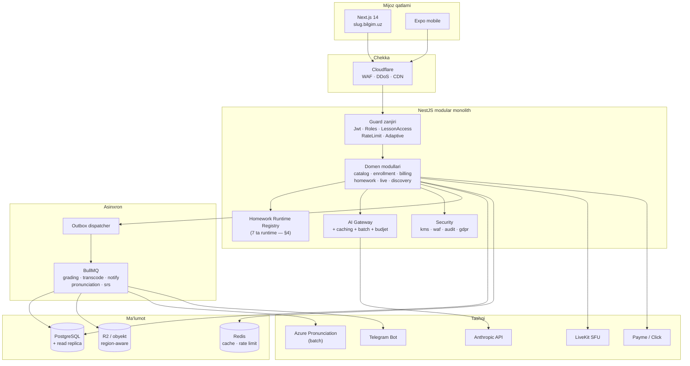
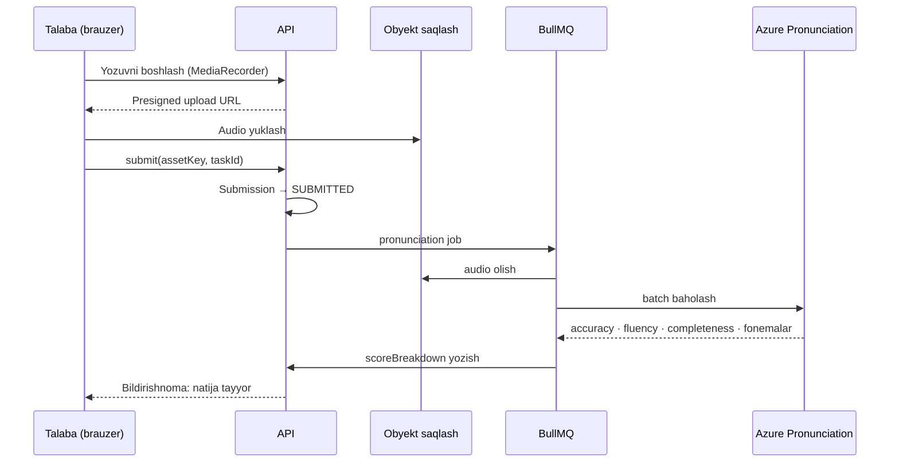

# 02 — Arxitektura va kod rejasi

> Bu hujjat [00 — Holat auditi](00-holat-auditi.md) va
> [01 — Tadqiqot hisoboti](01-tadqiqot-hisoboti.md) natijalarini birlashtiradi.
> Maqsad: mavjud ~200k satr kodni **buzmasdan**, uni tugallangan, kuchli va
> sotiladigan mahsulotga aylantirish.
>
> Prinsip: **kamroq yangi modul, ko'proq mavjudini yakunlash.** Loyihaning asosiy
> muammosi yetishmayotgan modullar emas — bu bir nechta *chala ulangan chegara*.

---

## 1. Arxitektura tamoyillari (o'zgarmaydi)

Mavjud kodda o'rnatilgan va **saqlanishi kerak** bo'lgan qarorlar:

| Tamoyil | Qayerda | Nega saqlanadi |
|---|---|---|
| Modular monolith (NestJS) | `apps/api/src/modules/*` | Mikroservis bu jamoa hajmi uchun erta. Modul chegaralari toza. |
| Outbox pattern | `infra/outbox/` | Barcha asinxron side-effect atomik. Ishlaydi. |
| Idempotency | `IdempotencyRecord` + interceptor | To'lov yo'li uchun majburiy. |
| Port/Adapter | `security/kms/kms.port.ts`, `ai/adapters/` | Test qilinadigan, provayder almashtiriladigan. **Bu naqshni kengaytiramiz.** |
| Property testing | `fast-check` (`*.property.spec.ts`) | Invariantlarni tekshiradi. Yangi kodga ham qo'llanadi. |
| Runtime registry | `homework/runtimes/registry.ts` | To'g'ri abstraksiya — faqat **to'ldirilmagan**. |

**Yangi qo'shiladigan tamoyil:**

> **Server hech qachon mijozdan kelgan bahoga ishonmaydi.**
> Har qanday `score`, `isCorrect`, `xp` qiymati serverda qayta hisoblanadi.

Bu §00 5.2 (speaking) muammosining ildizi va butun homework qatlamiga tegishli.

---

## 2. Maqsadli arxitektura



O'zgarishlar (qalin qismlar yangi): Homework Runtime Registry to'liq to'ldiriladi,
AI Gateway'ga caching/batch/budjet qo'shiladi, Azure pronunciation quvuri qo'shiladi,
obyekt saqlash region-aware bo'ladi.

---

## 3. Ish oqimi 0 — Poydevor (birinchi navbatda)

Bu ishlar boshqa hamma narsadan **oldin** bajarilishi kerak, chunki ularsiz qolgan
ishning natijasi yo'qolishi mumkin.

### 3.1. Git va sirlar

**Yaxshi xabar:** `.gitignore` allaqachon to'g'ri yozilgan va tekshirildi —
`.env`, `.env.*.local`, `infra/local/`, `node_modules/`, `.next/`, `dist/`,
`*.tsbuildinfo`, `*.log` hammasi ignore qilingan. Ya'ni `git init` xavfsiz.

1. `git init` + birinchi commit
2. Kichik tuzatish: `jest_output.txt` (111 KB test artefakti) `.gitignore` ga
   qo'shilsin yoki o'chirilsin — u `*.log` naqshiga tushmaydi
3. Sirlarni **rotatsiya qilish** — `.env` git'ga tushmaydi, lekin kalitlar uzoq vaqt
   himoyalanmagan fayl tizimida turgan va nusxa ko'chirilgan papkalarda tarqalgan
   (`~/Desktop/bilgimAI (Copy)` izi `jest_output.txt` da ko'rinadi):
   `ANTHROPIC_API_KEY`, `PAYME_KEY`, `JWT_SECRET`, `MASTER_ENCRYPTION_KEY`,
   `LIVEKIT_API_SECRET`, `R2_SECRET_ACCESS_KEY`, `TELEGRAM_BOT_TOKEN`, `SMTP_PASS`
4. Pre-commit hook: `gitleaks` yoki `git-secrets` — kelajakdagi tasodifiy commit'lardan

**Nima uchun birinchi:** 200k satr kod versiya nazoratisiz. Bitta noto'g'ri buyruq —
hamma narsa yo'qoladi.

### 3.2. Buzilgan testni tuzatish

`apps/api/src/modules/homework/submission.service.spec.ts:1494` — test `0.7` kutadi,
kod `0.75` yuboradi. Talab 13.8 `>= 0.75` deydi.

**Test noto'g'ri, kod to'g'ri.** Testni `0.75` ga o'zgartirish + `expect.stringContaining`
o'rniga aniq qiymat (yoki aksincha — bu bitta satr).

### 3.3. Kiro spec'larini arxivlash

`.kiro/specs/` → `docs/archive/kiro-original-spec/` ga ko'chirish + README qo'shish:
"Bu 2026-yil boshidagi original reja. Loyiha undan ancha o'zib ketgan. Joriy holat
uchun `docs/plan/` ga qarang."

**Nega:** bu hujjatlar hozir aktiv chalg'itish manbai — har kim (odam yoki AI)
ularni o'qib noto'g'ri xulosa chiqaradi.

---

## 4. Ish oqimi 1 — Homework runtime qatlamini yakunlash

**Bu eng katta va eng muhim ish.** U bir vaqtning o'zida mahsulot bo'shlig'ini va
xavfsizlik teshigini yopadi.

### 4.1. Muammoning tuzilishi

```
Frontend: 7 runtime  ──X──  Backend: 2 runtime
                              ↓
                   registry.get(SPEAKING) → null
                              ↓
                 "opaque JSON, validatsiya yo'q"
                              ↓
        Submission.answersJson ← talaba nima yozsa shu
```

### 4.2. Yechim: har bir runtime uchun to'liq shartnoma

Mavjud `HomeworkModuleRuntime` interfeysi
([runtimes/types.ts](../../apps/api/src/modules/homework/runtimes/types.ts))
uchta metodga ega: `validateConfig`, `validateAnswer`, `aiPromptInputs`.

**Interfeysga to'rtinchi metod qo'shiladi:**

```
score(config, answer) → { rawScore, maxScore, perItem[], needsAiReview }
```

Bu "server hech qachon mijoz bahosiga ishonmaydi" tamoyilini interfeys darajasida
majburiy qiladi. Deterministik modullar (gap-fill, grammar, multiple-choice, matching,
vocabulary) serverda to'liq baholanadi; subyektiv modullar (writing, speaking)
`needsAiReview: true` qaytaradi va AI/o'qituvchi quvuriga o'tadi.

### 4.3. Yoziladigan fayllar

`apps/api/src/modules/homework/runtimes/` ichida:

| Fayl | Vazifa | Baholash |
|---|---|---|
| `gap-fill.runtime.ts` | Bo'sh joyni to'ldirish | Deterministik (normalizatsiya + sinonim ro'yxati) |
| `grammar.runtime.ts` | Grammatika mashqlari | Deterministik |
| `vocabulary.runtime.ts` | Lug'at (FSRS bilan — §6) | Deterministik |
| `listening.runtime.ts` | Tinglash + savollar | Deterministik (savollar MCQ/gap-fill) |
| `multiple-choice.runtime.ts` | Ko'p tanlovli | Deterministik |
| `matching.runtime.ts` | Moslashtirish | Deterministik |
| `speaking.runtime.ts` | Gapirish | **Asinxron** — §5 quvuriga uzatadi |
| `registry.ts` | Yangilanadi — 7 ta runtime ro'yxatga olinadi | — |
| `types.ts` | `score()` metodi qo'shiladi | — |

**Muhim tafsilot — `null` xatti-harakati o'zgaradi.** Hozir `registry.get()` `null`
qaytarsa "opaque JSON qabul qilinadi". Yangi qoida:

> Ro'yxatga olinmagan modul turi uchun assignment **yaratib bo'lmaydi**
> (`MODULE_RUNTIME_NOT_AVAILABLE`), va mavjud submission'lar read-only bo'ladi.

Bu "fail closed" — xavfsizlik uchun to'g'ri standart.

### 4.4. Frontend tomonida o'zgarish

Har bir `module-runtimes/*.tsx` dan **ball hisoblash mantiqi olib tashlanadi**.
Mijoz faqat *javobni* yuboradi, *bahoni* emas. Ball serverdan qaytadi.

Bu `speaking-runtime.tsx` dagi `calcScore()` va boshqa runtime'lardagi shunga
o'xshash mantiqqa tegishli.

### 4.5. Ma'lumot modeli

`Submission.answersJson` `Json` bo'lib qoladi (moslashuvchanlik uchun), lekin:

- Yangi `Submission.scoreBreakdown Json?` — server hisoblagan per-item natija
- Yangi `Submission.autoScore Int?` — deterministik qism balli
- Mavjud `score Int?` — o'qituvchining yakuniy bahosi (o'zgarmaydi)

Bu avtomatik va qo'lda baholashni ajratadi — o'qituvchi avtomatik ballni ko'radi
va uni bekor qila oladi.

### 4.6. Testlar

Har bir runtime uchun:
- Unit: config validatsiyasi, javob validatsiyasi, baholash to'g'riligi
- **Property test:** `score()` hech qachon `maxScore` dan oshmasligi, hech qachon
  manfiy bo'lmasligi, bir xil kirish → bir xil chiqish (deterministik)
- **Xavfsizlik testi:** mijoz yuborgan `score` maydoni **e'tiborsiz qoldirilishi**

---

## 5. Ish oqimi 2 — Talaffuz quvuri (server tomonda)

### 5.1. Maqsadli oqim



### 5.2. Nega Azure, batch rejimida

Tadqiqot (§01 4.1): Azure Pronunciation Assessment real-time uchun $0,30/soat,
**batch uchun bepul**. Uy vazifasi real-time bo'lishi shart emas.

Bu bir vaqtda uchta muammoni hal qiladi:
- Mijoz tomonda baho (xavfsizlik)
- Ovoz Google'ga ketishi (maxfiylik)
- Haqiqiy talaffuz baholashning yo'qligi (mahsulot)

### 5.3. Port/Adapter (mavjud naqsh bo'yicha)

```
modules/homework/pronunciation/
  pronunciation.port.ts        ← interfeys
  azure.adapter.ts             ← Azure implementatsiyasi
  fake.adapter.ts              ← testlar uchun
  pronunciation.processor.ts   ← BullMQ worker
```

Bu `ai/adapters/` va `security/kms/` da allaqachon ishlatilgan naqsh — yangi konsepsiya emas.

### 5.4. ⚠️ Ovoz ma'lumotlari — huquqiy blok

§01 6.2 da batafsil: ovoz namunasi **biometrik ma'lumot** deb tasniflanishi mumkin,
va O'zbekiston qonunida biometrika **mamlakat ichida** saqlanishi shart.

**Shuning uchun arxitekturaga `StorageRegion` abstraksiyasi kiritiladi:**

```
MediaAsset.storageRegion  enum { INTERNATIONAL, UZ_LOCAL }
```

`R2Service` o'rniga `ObjectStorageRouter` — asset turiga qarab to'g'ri bucket'ga
yo'naltiradi. Ovoz `UZ_LOCAL`, video/PDF `INTERNATIONAL`.

Bu **javob qanday bo'lishidan qat'i nazar** to'g'ri qaror: keyinchalik migratsiya
qilish o'rniga bugun bitta enum qo'yish arzon.

**Bu ishni boshlashdan oldin mahalliy yurist bilan aniqlashtiring.**

### 5.5. Saqlash muddati

Ovoz uchun agressiv siyosat: baholangandan **30 kun** keyin audio o'chiriladi,
faqat ball va fonema tahlili qoladi. Cron job + `MediaAsset.expiresAt`.

---

## 6. Ish oqimi 3 — Lug'at va FSRS

### 6.1. Nega alohida ish oqimi

`VOCABULARY` shunchaki yana bir runtime emas — u **uzun muddatli o'quv holati**ni
talab qiladi, ya'ni yangi ma'lumot modeli.

### 6.2. Yangi modellar

```
model VocabularyItem {
  id, groupId?, teacherId?, term, definition,
  partOfSpeech, exampleSentence, audioAssetId?, cefrLevel
}

model VocabularyCard {          // talaba × so'z
  id, studentId, itemId,
  stability, difficulty,        // FSRS holati
  dueAt, lastReviewedAt, reps, lapses,
  @@unique([studentId, itemId])
}

model VocabularyReview {        // takrorlash tarixi (FSRS optimizatsiyasi uchun)
  id, cardId, rating, reviewedAt, elapsedDays, scheduledDays
}
```

### 6.3. FSRS

Tadqiqot (§01 4.3): FSRS 90% eslab qolish maqsadida SM-2 ga nisbatan **20–30% kam
takrorlash** talab qiladi; stability/difficulty/retrievability modellari va
17 ta o'rgatiladigan vazn.

Implementatsiya: `modules/vocabulary/fsrs/scheduler.ts` — sof funksiya, DI yo'q,
property test bilan qoplanadi (interval har doim musbat, monoton o'sish va h.k.).

`VocabularyReview` tarixi keyinchalik vaznlarni **talaba bo'yicha** optimallashtirish
imkonini beradi — bu v2 uchun, lekin ma'lumot bugundan yig'iladi.

### 6.4. Talaba tajribasi

Kunlik "review" navbati (`GET /vocabulary/due`) — gamification bilan tabiiy bog'lanadi
(`streak.service.ts` allaqachon bor).

---

## 7. Ish oqimi 4 — AI Gateway: xarajat va sifat

### 7.1. Prompt caching

`ai/adapters/anthropic.adapter.ts` va `homework/anthropic-ai-grading.adapter.ts` da
`cache_control: { type: 'ephemeral' }` bloklarini qo'shish.

Keshlanadigan prefiks (≥1024 token bo'lishi shart):
- System prompt + tutor policy qoidalari
- Grading rubrikasi + CEFR deskriptorlari
- Few-shot misollar

O'zgaruvchan qism (keshlanmaydi): talaba matni, savol.

**Kutilayotgan ta'sir:** cache-read normal input narxining ~10% — ya'ni tutor va
grading yo'llarida input xarajati ~90% kamayadi.

### 7.2. Batch API

Asinxron ishlar Batch API'ga o'tkaziladi (50% arzon):
- Grading precheck (`ai-grading.processor.ts`) — allaqachon BullMQ'da
- AI-text detection
- Specialty klassifikatsiya

Arxitektura o'zgarmaydi — faqat adapter darajasida. Yangi
`ai/adapters/anthropic-batch.adapter.ts`.

Caching + batch birga: xarajat bazaviy narxning **~1/10** iga tushishi mumkin.

### 7.3. Model darajalash

`ai.constants.ts` da ish turini modelga bog'laydigan xarita:

| Ish | Daraja |
|---|---|
| Tarjima, AI-text detection | Eng arzon (Haiku) |
| Tutor dialog, grading precheck | O'rta (Sonnet) |
| Murakkab esse tahlili | Yuqori |

**Muhim:** model nomlari konfiguratsiyadan olinadi, kodda hardcode qilinmaydi.

### 7.4. Budjet nazorati (hozir yo'q)

Uch darajali:

1. **Talaba/kun:** token budjeti (hozir faqat chaqiruv soni cheklangan — 60/10daq.
   Uzun kontekst bilan bu juda qimmat bo'lishi mumkin)
2. **O'qituvchi/oy:** obuna darajasiga bog'liq shift
3. **Global/kun:** alert + degraded rejim

`AiCall` jadvali allaqachon xarajatni yozadi — agregatsiya va chegara qo'shiladi.
Chegaradan oshganda `ai.errors.ts` ga yangi `AI_BUDGET_EXCEEDED` kodi.

### 7.5. CEFR integratsiyasi

Tadqiqot (§01 4.2): Cambridge Write & Improve muvaffaqiyatining o'zagi — ball
**CEFR** ga bog'langan.

- `Submission.cefrEstimate` maydoni (A1–C2)
- Grading prompt shabloniga CEFR deskriptorlari
- `StudentProfile` da CEFR progress tarixi
- Talaba dashboard'ida daraja grafigi

Arzon o'zgarish, yuqori marketing qiymati.

---

## 8. Ish oqimi 5 — Chegaralarni yopish

### 8.1. Telegram (§00 5.5)

Yetishmayotgani — `telegramChatId` binding. Kerak:
- Bot `/start` handler + deep link (`t.me/bot?start=<userId-token>`)
- `User.telegramChatId` maydoni
- `telegram.processor.ts` dagi TODO'ni yechish

O'zbekistonda Telegram asosiy kanal — bu MVP funksiyasi, "nice to have" emas.

### 8.2. Live recording (§00 5.4)

Aniqlashtirish kerak: `mediasoup-recorder.adapter.ts` (stub) yoki
`livekit-egress-recorder.adapter.ts` (haqiqiy)?

Qaror: **LiveKit Egress**'ni yakunlash, mediasoup adapterini **o'chirish**.
`live-stream` moduli (118 satr, 0 test) `live` (4706 satr) bilan solishtirilib,
dublikat bo'lsa birlashtirilsin.

### 8.3. Account recovery (§00 5.6)

`storeVerificationCode` / `verifyCode` implementatsiyasi. Test allaqachon yozilgan
(hozir `not implemented` kutadi) — testni yangilash + kod yozish.

### 8.4. Billing: ikkinchi provayder uchun tayyorlash

`Invoice` + `PaymeTransaction` hozir Payme'ga qattiq bog'langan.
Click/Uzum qo'shish uchun `PaymentProvider` porti kerak bo'ladi.

**Bu hozir qilinmaydi**, lekin `Invoice`ga `provider` enum maydoni qo'shiladi
(default `PAYME`) — keyinchalik migratsiya osonlashadi.

---

## 9. Ish oqimi 6 — B2B uchun eshikni ochiq qoldirish

§01 5.2: B2B'ni **bugun qurmaslik**, lekin **to'smaslik**.

### 9.1. Minimal bugungi o'zgarish

```
model Organization {              // yangi, lekin ishlatilmaydi
  id, name, slug, status, createdAt
}
```

Va mavjud modellarga **nullable** maydon:

```
TeacherProfile.organizationId  String?  @db.Uuid
Subscription.organizationId    String?  @db.Uuid
```

Hech qanday mantiq yozilmaydi. Faqat migratsiya. `null` = bugungi
o'qituvchi-markazli xatti-harakat.

### 9.2. Nega bu arziydi

Keyinchalik B2B qurishda: 60 modelga ega, ishlab turgan bazada ustun qo'shish
migratsiyasi — bu real xavf va downtime. Bugun bo'sh jadvalda — bu bir migratsiya fayli.

### 9.3. Rol ierarxiyasi

Hozir `UserRole { STUDENT, TEACHER, ADMIN }`. B2B uchun `ORG_ADMIN` kerak bo'ladi.
Enum'ga qiymat qo'shish keyinroq ham mumkin, lekin `RolesGuard` mantiqini
ierarxik qilish (hozir tekis) — buni oldindan o'ylash kerak.

---

## 10. Ish oqimi 7 — Test strategiyasi

Bu §00 5.7 dagi eng katta xavfni yopadi.

### 10.1. E2E — 0 dan boshlanadi

Vosita: **Playwright** (frontend + API birga).

Birinchi navbatdagi zanjirlar (pul va kontent yo'llari):

| # | Zanjir | Nega kritik |
|---|---|---|
| E1 | Register → verify email → trial boshlanadi | Yangi o'qituvchi kirish nuqtasi |
| E2 | Invite link → to'lov → enrollment request → tasdiqlash → dars ko'rish | **Pul yo'li — hech qachon tekshirilmagan** |
| E3 | Assignment yaratish → talaba topshiradi → AI precheck → o'qituvchi baholaydi | Mahsulot yadrosi |
| E4 | Enrollment'siz darsga kirish urinishi → 403 | Kontent himoyasi |
| E5 | Live session boshlanadi → talaba qo'shiladi → tugaydi → yozuv tayyor | Eng murakkab lifecycle |
| E6 | Multi-tenant: `aziz.bilgim.uz` to'g'ri o'qituvchini ko'rsatadi | Yangi arxitektura |

### 10.2. Frontend testlar

Hozir 2 ta. Prioritet — murakkab holатga ega komponentlar:
`assignment-builder.tsx` (1176 satr), `submission-editor.tsx` (633),
`homework-submission-form.tsx` (626), har bir `module-runtimes/*`.

### 10.3. Testsiz modullar

`gamification` (0), `admin` (1), `enrollment` (1), `live-stream` (0).
`enrollment` — pul yo'li; `gamification` — XP/reward manipulyatsiyasi;
`admin` — eng yuqori imtiyoz. Uchalasi ham jiddiy.

### 10.4. Yangi property testlar

| Invariant |
|---|
| Runtime `score()` hech qachon `maxScore` dan oshmaydi va manfiy bo'lmaydi |
| Mijoz yuborgan `score`/`xp` maydoni **hech qachon** hisobga olinmaydi |
| FSRS interval har doim musbat va monoton |
| AI budjet chegarasi hech qachon oshib ketmaydi |
| `organizationId = null` bo'lganda xatti-harakat bugungidek qoladi (regressiya) |

---

## 11. Bosqichlar

Bu **ketma-ketlik**, muddat emas — muddat jamoa hajmiga bog'liq.

### Bosqich A — Poydevor va xavfsizlik teshiklari

1. Git init + sirlar rotatsiyasi (§3.1)
2. Buzilgan test (§3.2), Kiro arxivlash (§3.3)
3. Homework runtime'lar (§4) — **eng katta ish**
4. Speaking server tomonga (§5) — huquqiy javobga bog'liq
5. E2E: E1, E2, E4 (§10.1)

*Chiqish mezoni:* mijoz tomonda baho qilish imkoniyati yo'q; pul yo'li E2E bilan qoplangan.

### Bosqich B — Mahsulot chuqurligi

6. FSRS lug'at moduli (§6)
7. CEFR integratsiyasi (§7.5)
8. Telegram (§8.1), account recovery (§8.3)
9. E2E: E3, E5, E6

### Bosqich C — Iqtisod va miqyos

10. Prompt caching + Batch API (§7.1, 7.2)
11. Model darajalash + budjet nazorati (§7.3, 7.4)
12. Live recording yakunlash (§8.2)
13. Testsiz modullarni qoplash (§10.3)

### Bosqich D — Kelajakka tayyorgarlik

14. `Organization` migratsiyasi (§9)
15. `PaymentProvider` porti (§8.4)
16. Frontend test qamrovi (§10.2)

**Nima uchun bu tartib:** Bosqich A da xavfsizlik va ma'lumot yo'qotish riski bor —
ular kutmaydi. Bosqich C (xarajat) muhim, lekin foydalanuvchi yo'q ekan, xarajat ham
yo'q — shuning uchun keyinroq.

---

## 12. Nima QILINMASLIGI kerak

Bu ro'yxat qilinadigan ishlar ro'yxati kabi muhim:

| ❌ Qilmang | Nega |
|---|---|
| Mikroservislarga bo'lish | Modular monolith bu hajm uchun to'g'ri. Bo'lish sun'iy murakkablik. |
| Yangi frontend framework | Next.js 14 ishlayapti, 0 tsc xatosi. |
| O'z ASR / LLM modeli | Mantiqsiz resurs sarfi. |
| GraphQL qo'shish | REST + OpenAPI ishlayapti (`packages/api-client`). |
| Barcha modullarni bir vaqtda refactor qilish | 200k satr — bosqichma-bosqich. |
| B2B'ni to'liq qurish | Talab tasdiqlanmagan. Faqat eshikni ochiq qoldiring. |
| Kiro spec'lariga qaytish | Ular eskirgan (§3.3). |

---

## 13. Ochiq savollar (qaror kerak)

| # | Savol | Kimga |
|---|---|---|
| Q1 | Ovoz yozuvi O'zbekiston qonunida biometrik ma'lumot hisoblanadimi? | **Yurist** — §5.4 ni blokladi |
| Q2 | Talabalarning yosh taqsimoti? Voyaga yetmaganlar ulushi? | Mahsulot — §03 rejasini belgilaydi |
| Q3 | `live-stream` moduli `live` bilan dublikatmi yoki alohida maqsadmi? | Kod egasi — §8.2 |
| Q4 | O'qituvchi obunasining rejalashtirilgan narxi? | Biznes — AI budjet shiftini belgilaydi (§7.4) |
| Q5 | Click/Uzum qo'shish rejada bormi? | Biznes — §8.4 prioritetini belgilaydi |

---

[← 01 Tadqiqot hisoboti](01-tadqiqot-hisoboti.md) ·
[03 Xavfsizlik va kontent rejasi →](03-xavfsizlik-va-kontent-rejasi.md)
